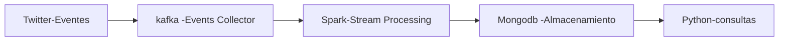

# Informe Proyecto 3

Obtener Data Streaming desde Twitter utilizando Kafka y almacenarlo en una base de datos mongo para luego realizar consultas de la información recolectada

## Arquitectura

## Fuente y Naturaleza de los Datos

La información se recolecta a través de topicos de los tweets que deseamos recolectar

## Sistema de ingesta de datos

kafka

## Almacenamiento de los datos

spark +mongo

## Análisis de datos

consultas a mongo a través de python
