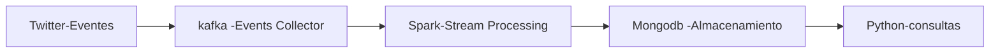

# Informe Proyecto 3

Obtener Data Streaming desde Twitter utilizando Kafka y almacenarlo en una base de datos mongo para luego realizar consultas de la información recolectada

## Arquitectura

## Fuente y Naturaleza de los Datos

"Tweets are the basic atomic building block of all things Twitter. Tweets are also known as “status updates.” The Tweet object has a long list of ‘root-level’ attributes, including fundamental attributes such as id, created_at, and text. Tweet objects are also the ‘parent’ object to several child objects. Tweet child objects include user, entities, and extended_entities. Tweets that are geo-tagged will have a place child object."

## Sistema de ingesta de datos

A topic is a category or feed name to which records are published. Topics in Kafka are always multi-subscriber; that is, a topic can have zero, one, or many consumers that subscribe to the data written to it.

For each topic, the Kafka cluster maintains a partitioned log

 bin/kafka-topics.sh --create --zookeeper localhost:2181 --replication-factor 1 --partitions 1 --topic bigdata

Producers
Producers publish data to the topics of their choice. The producer is responsible for choosing which record to assign to which partition within the topic. This can be done in a round-robin fashion simply to balance load or it can be done according to some semantic partition function (say based on some key in the record). More on the use of partitioning in a second!

Consumers
Consumers label themselves with a consumer group name, and each record published to a topic is delivered to one consumer instance within each subscribing consumer group. Consumer instances can be in separate processes or on separate machines.

## Almacenamiento de los datos

spark +mongo

## Análisis de datos

consultas a mongo a través de python
